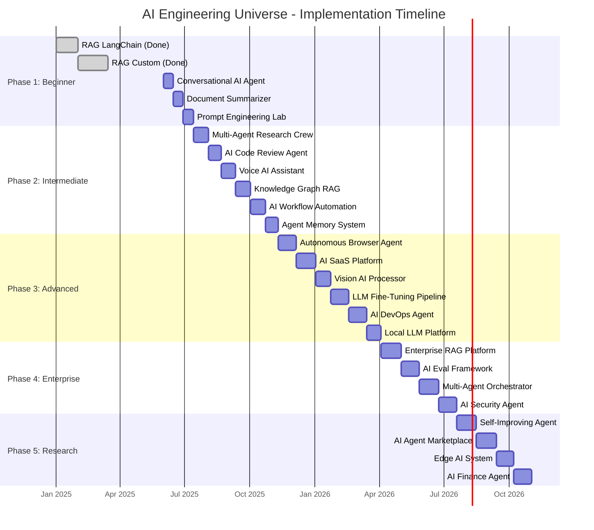
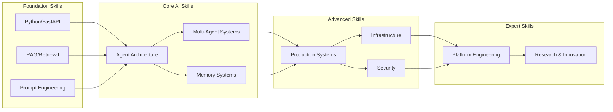

# 🗺️ AI Engineering Universe — Roadmap

## Master Dependency Graph

```mermaid
graph TD
    %% Phase 1 - Beginner (Green)
    P1["✅ 1. RAG LangChain"]:::done
    P2["✅ 2. RAG Custom"]:::done
    P3["🟡 3. Conv. AI Agent"]:::beginner
    P4["4. Doc Summarizer"]:::beginner
    P5["5. Prompt Lab"]:::beginner

    %% Phase 2 - Intermediate (Blue)
    P6["6. Multi-Agent Research"]:::intermediate
    P7["7. Code Review Agent"]:::intermediate
    P8["8. Voice AI"]:::intermediate
    P9["9. Knowledge Graph RAG"]:::intermediate
    P10["10. Workflow Automation"]:::intermediate
    P11["11. Memory System"]:::intermediate

    %% Phase 3 - Advanced (Orange)
    P12["12. Browser Agent"]:::advanced
    P13["13. AI SaaS Platform"]:::advanced
    P14["14. Vision AI"]:::advanced
    P15["15. Fine-Tuning Pipeline"]:::advanced
    P16["16. DevOps Agent"]:::advanced
    P17["17. Local LLM Platform"]:::advanced

    %% Phase 4 - Enterprise (Red)
    P18["18. Enterprise RAG"]:::enterprise
    P19["19. AI Eval Framework"]:::enterprise
    P20["20. Multi-Agent Orchestrator"]:::enterprise
    P21["21. Security Agent"]:::enterprise

    %% Phase 5 - Research (Purple)
    P22["22. Self-Improving Agent"]:::research
    P23["23. Agent Marketplace"]:::research
    P24["24. Edge AI"]:::research
    P25["25. Finance Agent"]:::research

    %% Dependencies
    P1 --> P6
    P2 --> P9
    P3 --> P6
    P3 --> P7
    P3 --> P8
    P3 --> P12
    P4 --> P14
    P5 --> P19
    P6 --> P20
    P7 --> P16
    P8 --> P13
    P9 --> P18
    P10 --> P20
    P11 --> P22
    P12 --> P23
    P13 --> P23
    P15 --> P17
    P16 --> P21
    P17 --> P24
    P18 --> P25
    P20 --> P23
    P22 --> P23

    %% Styling
    classDef done fill:#22c55e,stroke:#16a34a,color:#fff
    classDef beginner fill:#4ade80,stroke:#22c55e,color:#000
    classDef intermediate fill:#60a5fa,stroke:#3b82f6,color:#fff
    classDef advanced fill:#f59e0b,stroke:#d97706,color:#000
    classDef enterprise fill:#ef4444,stroke:#dc2626,color:#fff
    classDef research fill:#a855f7,stroke:#9333ea,color:#fff
```

---

## Phase Timeline

---

## Project Status Dashboard

| # | Project | Phase | Status | Dependencies | Key Skill |
|---|---------|-------|--------|--------------|-----------|
| 1 | RAG LangChain Chroma | 🟢 Beginner | ✅ Done | — | RAG, LangChain |
| 2 | RAG Custom Engine | 🟢 Beginner | ✅ Done | — | RAG internals |
| 3 | Conversational AI Agent | 🟢 Beginner | � In Progress | — | ReAct, tools |
| 4 | Document Summarizer | 🟢 Beginner | 🔴 Not Started | — | NLP pipelines |
| 5 | Prompt Engineering Lab | 🟢 Beginner | 🔴 Not Started | — | Prompt design |
| 6 | Multi-Agent Research Crew | 🔵 Intermediate | 🔴 Not Started | 1, 3 | Multi-agent |
| 7 | AI Code Review Agent | 🔵 Intermediate | 🔴 Not Started | 3 | Code analysis |
| 8 | Voice AI Assistant | 🔵 Intermediate | 🔴 Not Started | 3 | Voice, real-time |
| 9 | Knowledge Graph RAG | 🔵 Intermediate | 🔴 Not Started | 2 | Graph DB, multi-hop |
| 10 | AI Workflow Automation | 🔵 Intermediate | 🔴 Not Started | — | Workflow engines |
| 11 | Agent Memory System | 🔵 Intermediate | 🔴 Not Started | — | Memory architecture |
| 12 | Autonomous Browser Agent | 🟠 Advanced | 🔴 Not Started | 3 | Browser automation |
| 13 | AI SaaS Platform | 🟠 Advanced | 🔴 Not Started | 8 | SaaS, billing |
| 14 | Vision AI Processor | 🟠 Advanced | 🔴 Not Started | 4 | Vision, OCR |
| 15 | LLM Fine-Tuning Pipeline | 🟠 Advanced | 🔴 Not Started | — | Fine-tuning |
| 16 | AI DevOps Agent | 🟠 Advanced | 🔴 Not Started | 7 | DevOps, monitoring |
| 17 | Local LLM Platform | 🟠 Advanced | 🔴 Not Started | 15 | ML infra |
| 18 | Enterprise RAG Platform | 🔴 Enterprise | 🔴 Not Started | 9 | Enterprise arch |
| 19 | AI Eval Framework | 🔴 Enterprise | 🔴 Not Started | 5 | Testing, LLMOps |
| 20 | Multi-Agent Orchestrator | 🔴 Enterprise | 🔴 Not Started | 6, 10 | Orchestration |
| 21 | AI Security Agent | 🔴 Enterprise | 🔴 Not Started | 16 | AI security |
| 22 | Self-Improving Agent | 🟣 Research | 🔴 Not Started | 11 | Meta-learning |
| 23 | AI Agent Marketplace | 🟣 Research | 🔴 Not Started | 12, 13, 20 | Platforms |
| 24 | Edge AI System | 🟣 Research | 🔴 Not Started | 17 | Edge, federated |
| 25 | AI Finance Agent | 🟣 Research | 🔴 Not Started | 18 | FinTech |

---

## Skill Progression

---

## Next Steps

1. **Start with Project 3** (Conversational AI Agent) — it unlocks the most downstream projects
2. Focus on one project at a time — depth beats breadth
3. Each project should be demo-ready before moving to the next
4. Update this roadmap as projects complete

---

## Legend

| Symbol | Meaning |
|--------|---------|
| ✅ | Completed |
| 🔴 | Not Started |
| 🟡 | In Progress |
| 🟢 | Beginner Phase |
| 🔵 | Intermediate Phase |
| 🟠 | Advanced Phase |
| 🔴 | Enterprise Phase |
| 🟣 | Research Phase |
