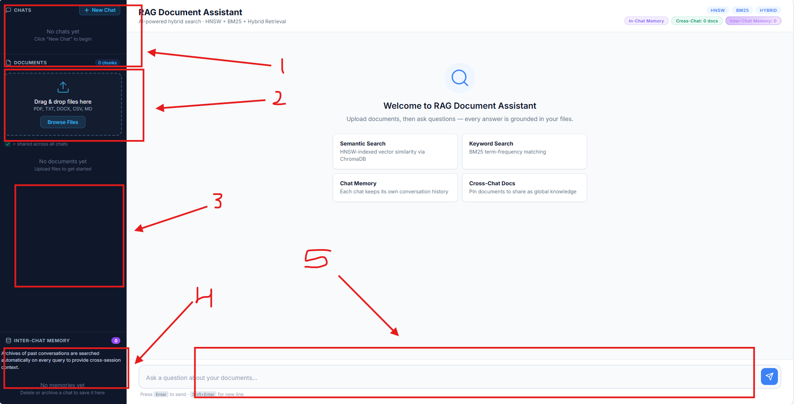

# RAG Projects

A collection of **Retrieval-Augmented Generation (RAG)** projects exploring different retrieval strategies, memory architectures, and LLM integration patterns. Each sub-directory is a self-contained project with its own dependencies, configuration, and documentation.

---

## Projects

### 1. RAG LangChain Chroma

> A production-ready conversational document assistant with **hybrid search** (HNSW vector + BM25), a **dual-layer memory system** (in-chat + cross-chat), and a browser-based chat UI — all served by a single FastAPI process.



**Key capabilities:**
- Upload PDF, DOCX, TXT, CSV, or Markdown files and chat with their content
- Hybrid retrieval: ChromaDB HNSW index fused with BM25 via `EnsembleRetriever`
- In-chat memory keeps the last 20 conversation turns in every prompt
- Cross-chat memory summarises closed sessions and semantically searches them on every new query
- Every answer includes inline `[Source: file, Chunk: N]` citations
- Full REST API documented at `/docs`

**Stack:** FastAPI · LangChain · ChromaDB · OpenAI · rank-bm25 · Vanilla JS

→ **[View full documentation](rag-langchain-chroma/README.md)**

---

### 2. RAG Custom Engine

> A complete RAG pipeline built entirely from scratch with **no LangChain and no ChromaDB** — custom HNSW vector store, Okapi BM25, hybrid retrieval (weighted ensemble + RRF), multi-query expansion, Self-RAG adaptive retrieval, contextual compression, and dual-layer memory.


**Key capabilities:**
- Custom HNSW vector store and BM25 index (pure Python, no external vector DB)
- Hybrid retrieval with weighted ensemble and Reciprocal Rank Fusion (RRF)
- Multi-query retriever: LLM generates query variants and merges results via RRF
- Self-RAG: 3-stage LLM evaluation (retrieval decision, relevance grading, hallucination check)
- Contextual compression: LLM extracts only relevant portions from retrieved chunks
- Pipeline orchestrator with step-by-step trace for frontend visualisation
- Full REST API documented at `/docs`

**Stack:** FastAPI · OpenAI · Pure Python · Vanilla JS

→ **[View full documentation](rag-custom-engine/README.md)**

---

<!-- Add new projects below in the same format:

### N. Project Name
> One-line description.

...highlights...

→ **[View full documentation](project-folder/README.md)**

---
-->

## Repository Layout

```
RAG/
├── README.md                      ← you are here
├── docs/                          ← Reference PDFs + interactive HTML dashboard
│   ├── documentation.html         ← Self-contained HTML docs dashboard (open in browser)
│   ├── comprehensive-documentation.pdf
│   └── executive-summary.pdf
├── rag-langchain-chroma/          ← Project 1: LangChain + ChromaDB HNSW hybrid RAG
└── rag-custom-engine/             ← Project 2: From-scratch HNSW, BM25, hybrid RAG
```

---

## Interactive Documentation

A self-contained HTML dashboard covering both projects — architecture, implementation details, API reference, comparison, and deficiencies — is available at:

**[docs/documentation.html](docs/documentation.html)** — open directly in any browser, no server required.
