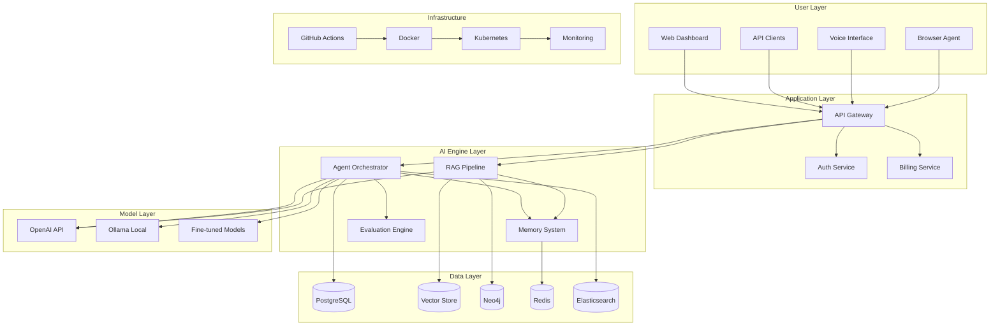
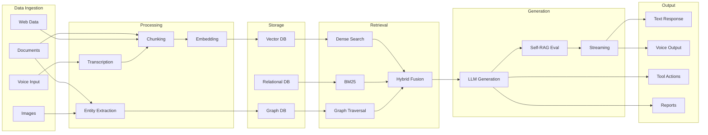
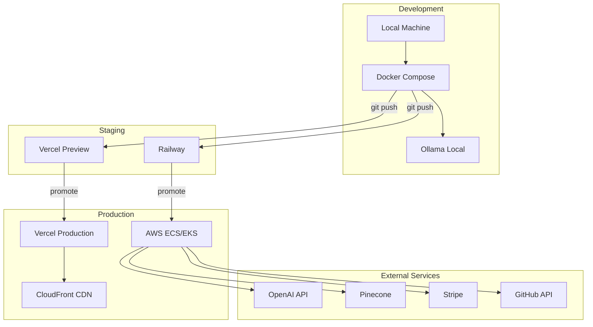

# Ecosystem Architecture Overview

## System-Level Architecture



## How Projects Connect



## Shared Component Architecture

### Common Backend Pattern (All Projects)

```
┌──────────────────────────────────────────────┐
│                  FastAPI App                   │
├──────────────────────────────────────────────┤
│  Middleware: CORS, Auth, Rate Limit, Logging │
├──────────────────────────────────────────────┤
│  Routers: /api/v1/...                        │
├──────────────────────────────────────────────┤
│  Services: Business logic layer              │
├──────────────────────────────────────────────┤
│  AI Engine: LLM calls, embeddings, agents    │
├──────────────────────────────────────────────┤
│  Data Layer: DB, cache, vector store         │
└──────────────────────────────────────────────┘
```

### Common Frontend Pattern (Next.js Projects)

```
┌──────────────────────────────────────────────┐
│              Next.js 14 App Router            │
├──────────────────────────────────────────────┤
│  Pages: app/(routes)/page.tsx                │
├──────────────────────────────────────────────┤
│  Components: Reusable UI components          │
├──────────────────────────────────────────────┤
│  Hooks: Custom React hooks                   │
├──────────────────────────────────────────────┤
│  API Client: Fetch wrapper for backend       │
├──────────────────────────────────────────────┤
│  State: React Context / Zustand              │
└──────────────────────────────────────────────┘
```

## Deployment Topology


