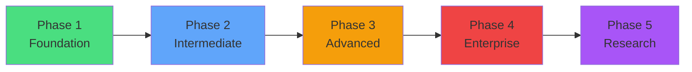

# AI Engineering Learning Path

## Overview

This learning path takes you from AI/ML fundamentals to building production-grade autonomous AI systems. Each phase builds on the previous, and projects are designed to be completed sequentially within each phase.

---

## Phase Map



---

## Phase 1: Foundation (Weeks 1-8)

### Prerequisites
- Python 3.11+ proficiency
- Basic understanding of REST APIs
- Familiarity with Git

### Skills Acquired
| Skill | Project | Level |
|-------|---------|-------|
| RAG fundamentals | Projects 1-2 | ████████░░ 80% |
| Agent patterns (ReAct) | Project 3 | ██████░░░░ 60% |
| NLP pipelines | Project 4 | ██████░░░░ 60% |
| Prompt engineering | Project 5 | ████████░░ 80% |
| FastAPI | All | ████████░░ 80% |
| LangChain basics | Projects 1, 4 | ██████░░░░ 60% |

### Learning Resources
- [LangChain Documentation](https://docs.langchain.com)
- [OpenAI Cookbook](https://cookbook.openai.com)
- [FastAPI Tutorial](https://fastapi.tiangolo.com/tutorial/)
- [RAG Survey Paper](https://arxiv.org/abs/2312.10997)

### Key Concepts
1. **Embeddings & Vector Search** — How text becomes searchable vectors
2. **Retrieval strategies** — Dense, sparse, and hybrid retrieval
3. **Prompt engineering** — System prompts, few-shot, chain-of-thought
4. **Tool calling** — Function calling, ReAct pattern
5. **Streaming** — Server-sent events, WebSockets

---

## Phase 2: Intermediate (Weeks 9-26)

### Prerequisites
- Completed Phase 1 or equivalent
- Basic Docker knowledge
- Frontend basics (React/Next.js)

### Skills Acquired
| Skill | Project | Level |
|-------|---------|-------|
| Multi-agent orchestration | Project 6 | ████████░░ 80% |
| LangGraph state machines | Projects 6, 7 | ████████░░ 80% |
| Voice AI (STT/TTS) | Project 8 | ██████░░░░ 60% |
| Knowledge graphs | Project 9 | ██████░░░░ 60% |
| Workflow engines | Project 10 | ████████░░ 80% |
| Memory architectures | Project 11 | ████████░░ 80% |
| Next.js frontend | All | ████████░░ 80% |
| Docker Compose | All | ██████░░░░ 60% |

### Learning Resources
- [LangGraph Documentation](https://langchain-ai.github.io/langgraph/)
- [Neo4j Graph Academy](https://graphacademy.neo4j.com)
- [OpenAI Whisper](https://platform.openai.com/docs/guides/speech-to-text)
- [React Flow](https://reactflow.dev)

### Key Concepts
1. **Agent communication** — Message passing, shared state, delegation
2. **Graph databases** — Nodes, relationships, Cypher queries
3. **Real-time systems** — WebSockets, audio streaming, low latency
4. **Task queues** — Celery, Redis, async processing
5. **State machines** — LangGraph graphs, conditional edges

---

## Phase 3: Advanced (Weeks 27-50)

### Prerequisites
- Completed Phase 2
- Docker + basic Kubernetes
- Database design experience
- JavaScript/TypeScript proficiency

### Skills Acquired
| Skill | Project | Level |
|-------|---------|-------|
| Browser automation | Project 12 | ████████░░ 80% |
| SaaS architecture | Project 13 | ████████████ 100% |
| Computer vision | Project 14 | ██████░░░░ 60% |
| Model fine-tuning | Project 15 | ████████░░ 80% |
| DevOps + AI | Project 16 | ████████░░ 80% |
| ML infrastructure | Project 17 | ████████░░ 80% |

### Learning Resources
- [Playwright Documentation](https://playwright.dev)
- [Stripe Integration Guide](https://stripe.com/docs)
- [OpenAI Fine-tuning Guide](https://platform.openai.com/docs/guides/fine-tuning)
- [vLLM Documentation](https://docs.vllm.ai)

### Key Concepts
1. **Autonomous systems** — Planning, execution, error recovery
2. **Multi-tenancy** — Isolation, billing, usage tracking
3. **Model serving** — Inference optimization, batching, quantization
4. **Vision AI** — Image understanding, OCR, structured extraction
5. **Production patterns** — Rate limiting, caching, monitoring

---

## Phase 4: Enterprise (Weeks 51-70)

### Prerequisites
- Completed Phase 3
- Production deployment experience
- Security fundamentals
- System design knowledge

### Skills Acquired
| Skill | Project | Level |
|-------|---------|-------|
| Enterprise architecture | Project 18 | ████████████ 100% |
| AI evaluation/testing | Project 19 | ████████████ 100% |
| Platform engineering | Project 20 | ████████████ 100% |
| AI security | Project 21 | ████████░░ 80% |

### Key Concepts
1. **RBAC & multi-source integration** — Connector architecture
2. **LLMOps** — Testing, evaluation, monitoring, regression detection
3. **Orchestration at scale** — Agent registries, execution engines
4. **AI security** — Prompt injection, guardrails, red teaming
5. **Production engineering** — SLAs, monitoring, incident response

---

## Phase 5: Research (Weeks 71-90)

### Prerequisites
- Completed Phase 4
- Understanding of ML theory
- Distributed systems knowledge

### Skills Acquired
| Skill | Project | Level |
|-------|---------|-------|
| Meta-learning | Project 22 | ████████░░ 80% |
| Platform building | Project 23 | ████████████ 100% |
| Edge computing | Project 24 | ██████░░░░ 60% |
| Financial AI | Project 25 | ████████░░ 80% |

### Key Concepts
1. **Self-improvement** — Evaluation loops, strategy evolution
2. **Marketplace dynamics** — Sandboxing, composability, trust
3. **Edge AI** — Quantization, federated learning, model compression
4. **Domain AI** — Financial data, regulatory compliance, real-time

---

## Skill Progression Matrix

```
Week   1    10    20    30    40    50    60    70    80    90
       |     |     |     |     |     |     |     |     |     |
RAG    ████████████░░░░░░░░░░░░░░░░░░░░░░░░░░░░░░░░░░░░░░░░░
Agents ░░░░████████████████████████████████████████████████████
LLMOps ░░░░░░░░░░░░░░████████████████████████████████████████░
Frontend░░░░░░░░████████████████████████████████████████████████
DevOps ░░░░░░░░░░░░░░░░░░░░████████████████████████████████████
Security░░░░░░░░░░░░░░░░░░░░░░░░░░░░░░░░████████████████████████
Research░░░░░░░░░░░░░░░░░░░░░░░░░░░░░░░░░░░░░░░░████████████████
```

---

## Certification Milestones

| Milestone | After Project | Achievement |
|-----------|--------------|-------------|
| 🥉 RAG Developer | 2 | Can build production RAG systems |
| 🥉 AI Agent Builder | 5 | Can build tool-using agents |
| 🥈 Multi-Agent Engineer | 11 | Can orchestrate agent teams |
| 🥈 Full-Stack AI Developer | 13 | Can build complete AI SaaS |
| 🥇 AI Platform Engineer | 20 | Can build enterprise AI platforms |
| 🏆 AI Systems Architect | 25 | Complete mastery |

---

## Recommended Daily Practice

| Activity | Time | Purpose |
|----------|------|---------|
| Build/code | 2-3 hours | Project progress |
| Read papers/docs | 30 min | Stay current |
| Review open source | 30 min | Learn patterns |
| Write documentation | 15 min | Solidify understanding |
