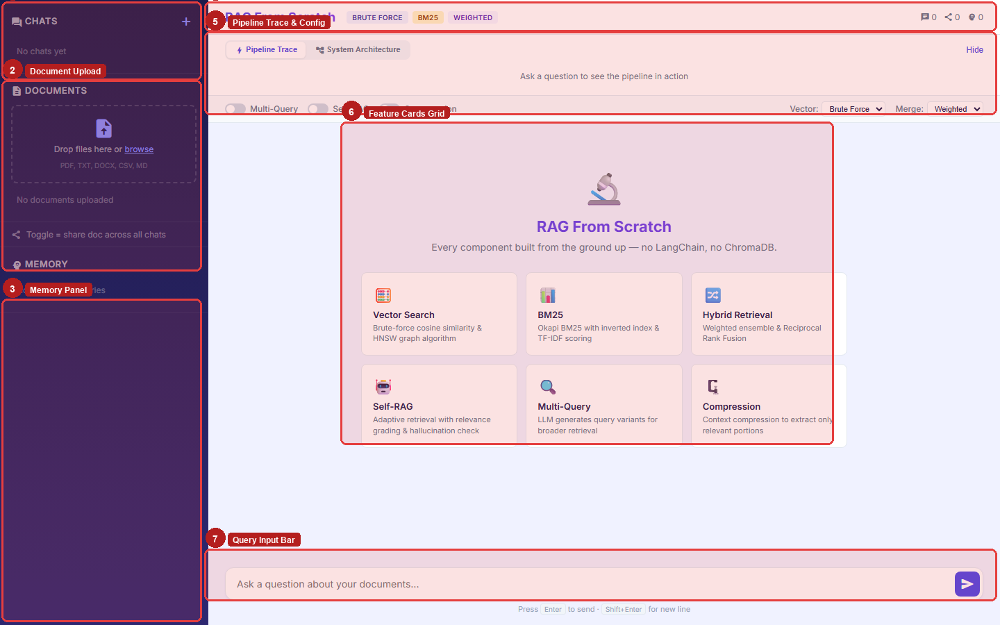
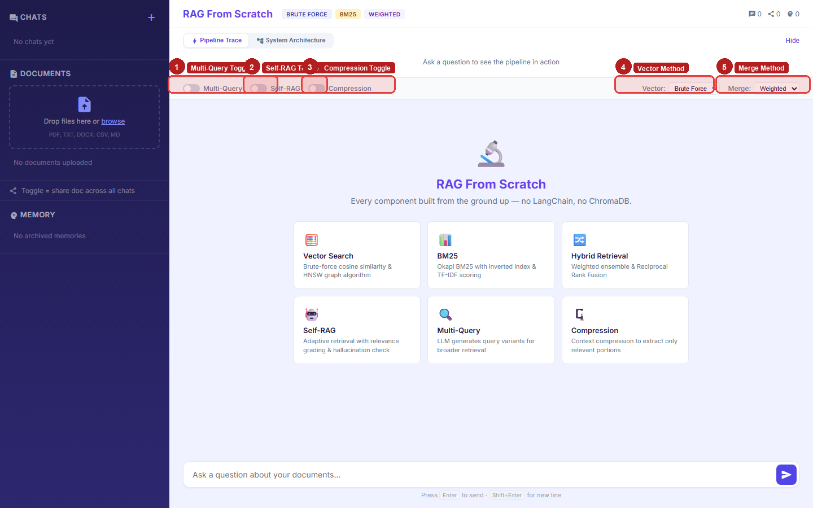
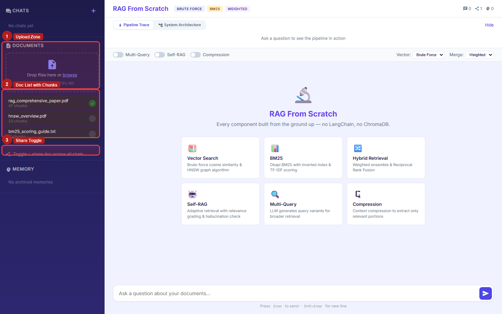
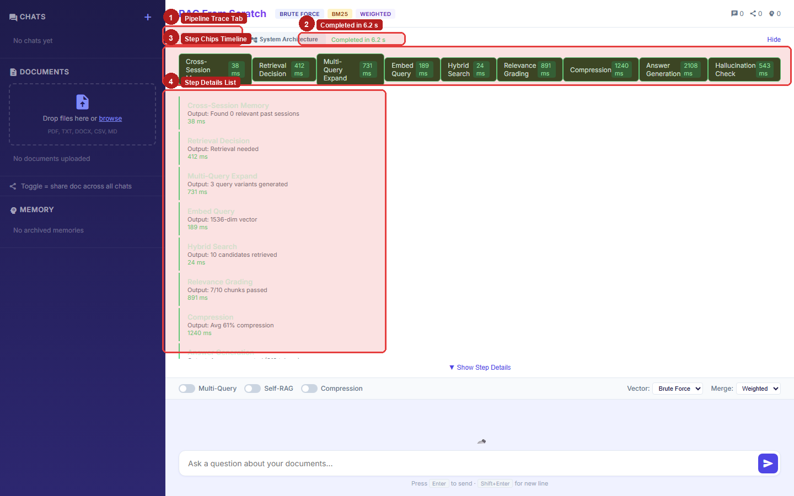
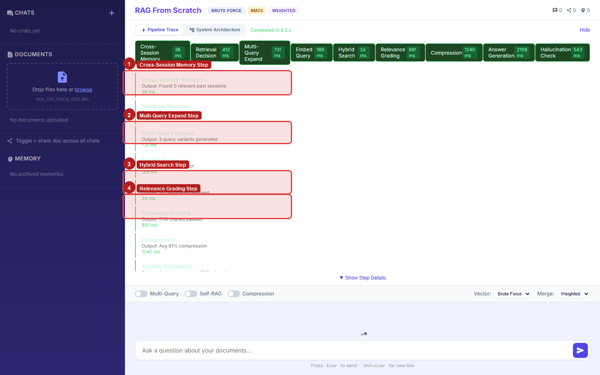
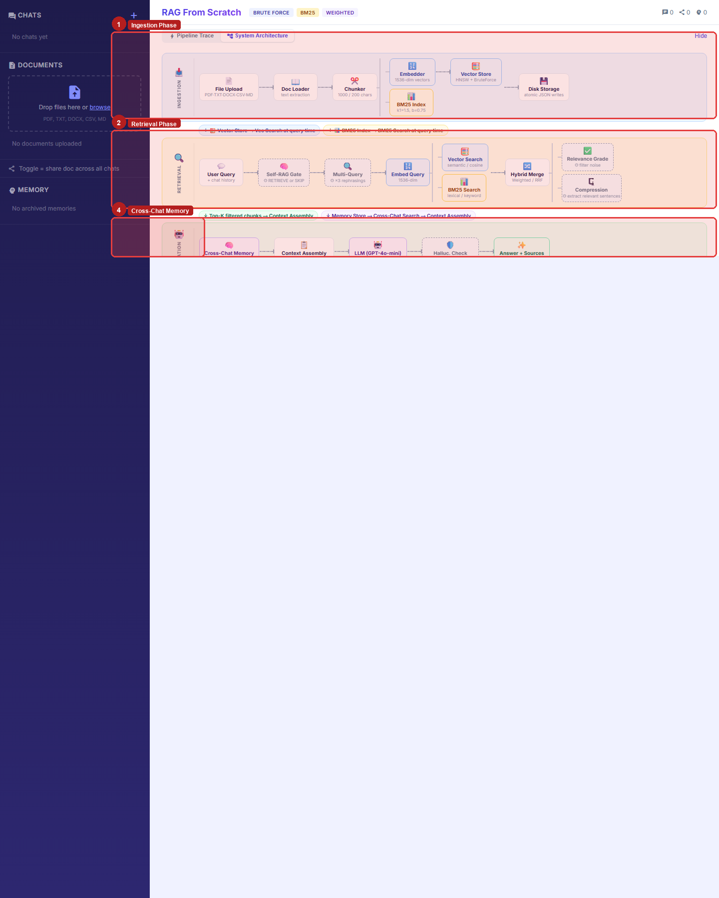
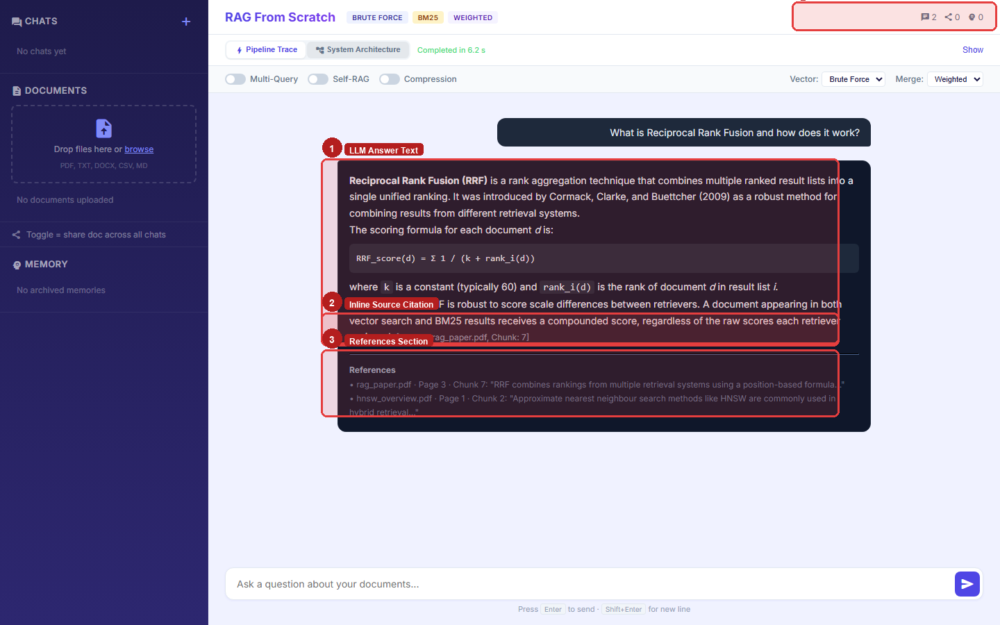
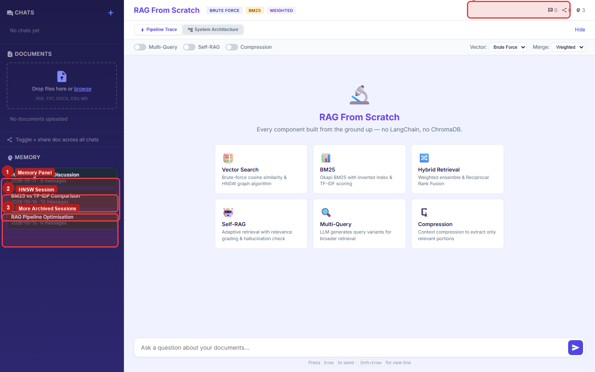

# RAG Custom Engine

A complete **Retrieval-Augmented Generation (RAG)** pipeline built entirely **from scratch** — no LangChain, no ChromaDB, no external vector database. Every component is implemented in pure Python: a custom HNSW vector store, Okapi BM25 keyword index, hybrid retrieval with Reciprocal Rank Fusion, Self-RAG adaptive retrieval, contextual compression, multi-query expansion, and a dual-layer memory system.

The goal is to be a transparent reference implementation where every algorithm is readable, tunable, and fully decoupled from third-party ML frameworks.

---

## Table of Contents

- [Overview](#overview)
- [Screenshots](#screenshots)
- [Key Features](#key-features)
- [Architecture](#architecture)
  - [High-Level Diagram](#high-level-diagram)
  - [Module Breakdown](#module-breakdown)
- [Directory Structure](#directory-structure)
- [Retrieval Pipeline](#retrieval-pipeline)
  - [Hybrid Retrieval (Weighted Ensemble + RRF)](#hybrid-retrieval-weighted-ensemble--rrf)
  - [Multi-Query Retriever](#multi-query-retriever)
  - [Self-RAG (Adaptive Retrieval)](#self-rag-adaptive-retrieval)
  - [Contextual Compression](#contextual-compression)
- [Pipeline Orchestrator](#pipeline-orchestrator)
- [Memory System](#memory-system)
  - [In-Chat Session Memory](#in-chat-session-memory)
  - [Cross-Session Memory](#cross-session-memory)
  - [Pipeline Trace Store](#pipeline-trace-store)
- [API Reference](#api-reference)
  - [Documents](#documents)
  - [Sessions](#sessions)
  - [Query](#query)
  - [Cross-Chat Memory](#cross-chat-memory)
  - [Traces](#traces)
  - [Stats](#stats)
- [Configuration](#configuration)
- [Prerequisites](#prerequisites)
- [Installation & Setup](#installation--setup)
- [Running the Application](#running-the-application)
- [Supported Document Formats](#supported-document-formats)
- [Tech Stack](#tech-stack)
- [Data Storage](#data-storage)
- [Known Deficiencies](#known-deficiencies)

---

## Overview

This project replicates — and in several ways extends — what production RAG frameworks do under the hood, but with every layer exposed:

- A **custom HNSW** (Hierarchical Navigable Small World) graph index and brute-force cosine search are both implemented from scratch in pure Python with JSON persistence.
- **Okapi BM25** keyword ranking is implemented without `rank-bm25` or any library; it is a from-scratch TF-IDF variant.
- **Hybrid retrieval** fuses vector and BM25 results using either a **weighted score ensemble** or **Reciprocal Rank Fusion (RRF)**.
- **Self-RAG** adds three LLM-based evaluation gates: retrieval decision, relevance grading, and hallucination checking.
- **Contextual compression** trims irrelevant sentences from chunks before generation.
- A **pipeline orchestrator** records timing and metadata for every step and streams them as Server-Sent Events to the frontend.

---

## Screenshots

### 1 — Application UI Overview



The full interface on first load. Numbered regions:

| Box | Region | Description |
|---|---|---|
| **1** | **Chats Panel** (top-left sidebar) | Lists all chat sessions. The **+ New Chat** button creates an isolated session with its own document context. |
| **2** | **Document Upload** (middle sidebar) | Drag-and-drop zone that accepts PDF, TXT, DOCX, CSV, and Markdown. Each upload triggers chunking, embedding, and dual BM25+HNSW indexing. |
| **3** | **Memory Panel** (bottom sidebar) | Shows archived cross-session summaries that the model can reference across conversations. |
| **4** | **Header & Tech Badges** | Displays the active retrieval method badges (**BRUTE FORCE**, **BM25**, **WEIGHTED**) and chat/share/memory counters top-right. |
| **5** | **Pipeline Trace & Config** | The expandable trace panel that shows live step timing and the config toggles for Multi-Query, Self-RAG, Compression, Vector method, and Merge strategy. |
| **6** | **Feature Cards Grid** | Shows on idle — six clickable cards summarising each retrieval mode supported by the engine. |
| **7** | **Query Input Bar** | Main question input. Enter to send; Shift+Enter for newline. |

---

### 2 — Pipeline Configuration Controls



Close-up of the pipeline configuration bar that appears below the Pipeline Trace tab:

| Box | Control | Description |
|---|---|---|
| **1** | **Multi-Query Toggle** | Enables the multi-query expander — the LLM generates 3 query variants and the results are merged via RRF before the main retrieval step. |
| **2** | **Self-RAG Toggle** | Activates the three Self-RAG gates: retrieval decision, relevance grading, and hallucination check. |
| **3** | **Compression Toggle** | Enables contextual compression — each retrieved chunk is passed through the LLM to extract only the sentences relevant to the query. |
| **4** | **Vector Method** | Selects the vector search backend: **Brute Force** (exact cosine scan) or **HNSW** (approximate nearest-neighbour graph). |
| **5** | **Merge Method** | Controls how vector and BM25 result lists are fused: **Weighted** (score-based ensemble) or **RRF** (Reciprocal Rank Fusion). |

---

### 3 — Document Upload & Ingestion



The document sidebar after ingesting three files:

| Box | Region | Description |
|---|---|---|
| **1** | **Upload Zone** | Dashed drag-and-drop area. Clicking the **browse** link opens a system file picker. Accepts PDF, TXT, DOCX, CSV, MD. |
| **2** | **Document List with Chunk Counts** | Each ingested file shows its name and the number of chunks created. A green checkmark indicates the file is shared across all sessions. |
| **3** | **Share Toggle** | The small share icon on each document row toggles the document's *global share* status — shared docs are available as background context in every chat session. |

---

### 4 — Live Pipeline Trace



The Pipeline Trace panel immediately after a query completes:

| Box | Region | Description |
|---|---|---|
| **1** | **Pipeline Trace Tab** | The active tab. Clicking it while a query runs shows real-time step updates pushed as Server-Sent Events. |
| **2** | **Completed in 6.2 s** | Total wall-clock time for the full pipeline run, shown next to the tab bar once the query finishes. |
| **3** | **Step Chips Timeline** | A horizontal bar of colour-coded step chips, each showing the step name and its duration in milliseconds. Hovering a chip scrolls the detail list below to that step. |
| **4** | **Step Details List** | Expanded view of each pipeline step: step name (green), output summary, and timing. Gives full per-step observability into what the retrieval chain did. |

---

### 5 — Pipeline Step Breakdown



Individual step entries in the pipeline trace detail list:

| Box | Step | What it shows |
|---|---|---|
| **1** | **Cross-Session Memory** | Searched the cross-chat memory store; found 0 relevant past sessions (38 ms). |
| **2** | **Multi-Query Expand** | Generated 3 query variants from the user's question; used for broader retrieval (731 ms). |
| **3** | **Hybrid Search** | Retrieved 10 candidate chunks by fusing BM25 and HNSW vector results (24 ms). |
| **4** | **Relevance Grading** | LLM scored each chunk for relevance; 7/10 chunks passed the relevance threshold (891 ms). |

---

### 6 — System Architecture Diagram



The built-in architecture diagram (System Architecture tab) shows all pipeline phases:

| Box | Phase | Components |
|---|---|---|
| **1** | **Ingestion Phase** | File Upload → Doc Loader → Chunker → Embedder + BM25 Index → Vector Store (HNSW + Brute Force) → Disk Storage |
| **2** | **Retrieval Phase** | User Query → Self-RAG Gate → Multi-Query → Embed Query → Vector Search + BM25 Search → Hybrid Merge → Relevance Grade + Compression |
| **3** | **Generation Phase** | Cross-Chat Memory → Context Assembly → LLM (GPT-4o-mini) → Hallucination Check → Answer + Sources |
| **4** | **Cross-Chat Memory** | The first node in the Generation phase — searches archived summaries and injects relevant context before the LLM call. |

---

### 7 — Grounded RAG Answer with Citations



A completed query response in the chat window:

| Box | Region | Description |
|---|---|---|
| **1** | **LLM Answer Text** | The generated response, grounded exclusively in uploaded documents. Formatted with bold terms and a mathematical formula block. |
| **2** | **Inline Source Citation** | `[Source: rag_paper.pdf, Chunk: 7]` citations embedded inline — every factual claim traces to a specific chunk. |
| **3** | **References Section** | A collated list of all source chunks used, with filename, chunk number, and a verbatim snippet from the retrieved text. |
| **4** | **Chat/Memory Counters** | Top-right header shows `🗨 2` (2 messages in this session), `🔗 0` shares, `🔑 0` cross-session memories retrieved. |

---

### 8 — Cross-Session Memory Panel



The sidebar Memory panel showing three archived conversation summaries:

| Box | Region | Description |
|---|---|---|
| **1** | **Memory Panel** | The bottom-left sidebar section listing all archived session summaries available for future retrieval. |
| **2** | **HNSW Algorithm Discussion** | An archived session from 2026-05-17 with 8 messages — the LLM summarised this conversation and stored it as a retrievable memory. |
| **3** | **More Archived Sessions** | Additional sessions (BM25 vs TF-IDF Comparison, RAG Pipeline Optimisation) are automatically searched on every query to inject relevant past context. |
| **4** | **Memory Count Badge** | Top-right badge showing `🔑 3` — 3 cross-session memories are currently stored and available for retrieval. |

---


| Feature | Description |
|---|---|
| **Custom HNSW Vector Store** | Pure-Python HNSW graph + brute-force cosine fallback; JSON persistence; thread-safe singleton |
| **Custom BM25 Index** | Okapi BM25 ranking; add/remove documents; JSON persistence |
| **Hybrid Retrieval** | Weighted score ensemble and Reciprocal Rank Fusion (RRF) modes; configurable per-request |
| **Multi-Query Retriever** | LLM generates N alternative phrasings; all variants searched; results merged via RRF |
| **Self-RAG (Adaptive Retrieval)** | 3-stage LLM gates: retrieval decision → relevance grading → hallucination check |
| **Contextual Compression** | LLM extracts only relevant sentences from each retrieved chunk |
| **Pipeline Orchestrator** | Step-by-step trace with timing; async streaming via SSE; trace stored per session |
| **Dual-Layer Memory** | In-chat session history + cross-session LLM summarisation with vector search |

---

## Architecture

### High-Level Diagram

```
┌───────────────────────────────────────────────────────────────────┐
│                        Browser (SPA)                              │
│                  static/index.html + app.js                       │
│           (Chat UI + Pipeline Trace Visualiser)                   │
└────────────────────────┬──────────────────────────────────────────┘
                         │  HTTP / REST  (port 8001)
┌────────────────────────▼──────────────────────────────────────────┐
│                    FastAPI Application                            │
│                        main.py                                    │
│                                                                   │
│  ┌──────────────────┐  ┌────────────────────────────────────────┐ │
│  │   api/routes.py  │  │       api/request_models.py            │ │
│  │  (REST endpoints)│  │       (Pydantic schemas)               │ │
│  └────────┬─────────┘  └────────────────────────────────────────┘ │
│           │                                                       │
│  ┌────────▼─────────────────────────────────────────────────────┐ │
│  │              orchestration/rag_orchestrator.py               │ │
│  │           (Pipeline coordinator + SSE streaming)             │ │
│  │                                                              │ │
│  │  Step 1: Cross-Session Memory Search                         │ │
│  │  Step 2: Retrieval Decision (Self-RAG gate 1)               │ │
│  │  Step 3: Multi-Query Expansion (optional)                    │ │
│  │  Step 4: Hybrid Search (vector + BM25)                      │ │
│  │  Step 5: Relevance Grading (Self-RAG gate 2)               │ │
│  │  Step 6: Contextual Compression (optional)                   │ │
│  │  Step 7: Answer Generation                                   │ │
│  │  Step 8: Hallucination Check (Self-RAG gate 3)              │ │
│  └────────┬─────────────────────────────────────────────────────┘ │
│           │                                                       │
│  ┌────────▼──────────┐  ┌────────────────┐  ┌──────────────────┐ │
│  │    indexing/      │  │   retrieval/   │  │   generation/    │ │
│  │  hnsw_vector_store│  │  hybrid_search │  │ answer_generator │ │
│  │  bm25_index       │  │  multi_query   │  │  (OpenAI LLM)    │ │
│  │  document_loader  │  │  adaptive_retr │  └──────────────────┘ │
│  │  text_splitter    │  │  contextual_   │                       │
│  │  openai_embeddings│  │  compression   │                       │
│  └────────┬──────────┘  └────────────────┘                       │
│           │                                                       │
│  ┌────────▼─────────────────────────────────────────────────────┐ │
│  │                       memory/                                │ │
│  │  session_history_store.py  — in-chat multi-turn history      │ │
│  │  cross_session_memory.py   — LLM summaries + vector search   │ │
│  │  trace_store.py            — pipeline step traces per session│ │
│  └──────────────────────────────────────────────────────────────┘ │
└───────────────────────────────────────────────────────────────────┘
                         │
          ┌──────────────┼─────────────────┐
          ▼              ▼                 ▼
  ┌──────────────┐  ┌──────────┐  ┌─────────────┐
  │  JSON Files  │  │ OpenAI   │  │ JSON Files  │
  │ vector_store │  │   API    │  │  bm25_index │
  │ bm25_index   │  │ Embeddings│  │  sessions   │
  │ sessions     │  │ GPT-4o   │  │  traces     │
  └──────────────┘  └──────────┘  └─────────────┘
```

### Module Breakdown

| Module | File(s) | Responsibility |
|---|---|---|
| **Entry Point** | `main.py` | FastAPI app setup, lifespan hooks (load stores), rotating log handler, static file serving |
| **Configuration** | `config.py` | Pydantic `Settings`; loads `.env`; all tunable parameters |
| **API Layer** | `api/api_routes.py` | All REST endpoints; sync and streaming query handlers |
| **API Schemas** | `api/request_models.py` | Pydantic v2 request/response models |
| **Orchestrator** | `orchestration/rag_orchestrator.py` | Pipeline coordinator; `PipelineStep` / `PipelineConfig` / `PipelineResult` dataclasses; async SSE streaming |
| **Document Loader** | `indexing/document_loader.py` | Format-specific loaders (PDF, DOCX, TXT, CSV, MD) — no LangChain |
| **Text Splitter** | `indexing/text_splitter.py` | Recursive character splitter with configurable chunk size and overlap |
| **Embeddings** | `indexing/openai_embeddings.py` | Direct OpenAI embedding calls (`text-embedding-3-small`); batch support |
| **Vector Store** | `indexing/hnsw_vector_store.py` | Pure-Python HNSW graph + brute-force cosine; thread-safe singleton; JSON persistence |
| **BM25 Index** | `indexing/bm25_index.py` | Okapi BM25 from scratch; add/remove by metadata; JSON persistence |
| **Hybrid Search** | `retrieval/hybrid_search.py` | Score normalisation; weighted ensemble; Reciprocal Rank Fusion (RRF) |
| **Multi-Query** | `retrieval/multi_query_retriever.py` | LLM query variant generation; per-variant hybrid search; RRF merge |
| **Self-RAG** | `retrieval/adaptive_retrieval.py` | 3-stage LLM evaluation (retrieval decision, relevance grading, hallucination check) |
| **Compression** | `retrieval/contextual_compression.py` | Per-chunk LLM extraction of query-relevant sentences |
| **Answer Generator** | `generation/answer_generator.py` | System prompt; context formatting; OpenAI LLM call; source extraction |
| **Session Memory** | `memory/session_history_store.py` | Per-session message history; persisted to `data/sessions.json` |
| **Cross-Session** | `memory/cross_session_memory.py` | LLM summarisation + custom vector search for cross-session continuity |
| **Trace Store** | `memory/trace_store.py` | Per-session pipeline step traces; persisted to `data/traces.json` |

---

## Directory Structure

```
rag-custom-engine/
├── main.py                         # FastAPI app entry point + logging setup
├── config.py                       # All configuration via pydantic-settings
├── requirements.txt                # Python dependencies
├── .env                            # Secret keys and overrides (not committed)
├── pytest.ini                      # pytest configuration
│
├── api/
│   ├── api_routes.py               # All REST API endpoints
│   └── request_models.py           # Pydantic v2 request/response schemas
│
├── indexing/
│   ├── document_loader.py          # Load PDF, DOCX, TXT, CSV, MD files
│   ├── text_splitter.py            # Recursive character text splitter
│   ├── openai_embeddings.py        # OpenAI embedding calls (batch-ready)
│   ├── hnsw_vector_store.py        # Custom HNSW + brute-force vector store
│   └── bm25_index.py               # Custom Okapi BM25 keyword index
│
├── retrieval/
│   ├── hybrid_search.py            # Weighted ensemble + RRF fusion
│   ├── multi_query_retriever.py    # LLM query variants + RRF merge
│   ├── adaptive_retrieval.py       # Self-RAG: 3-stage LLM evaluation
│   └── contextual_compression.py  # LLM-based chunk compression
│
├── generation/
│   └── answer_generator.py         # LLM answer generation + source extraction
│
├── orchestration/
│   └── rag_orchestrator.py         # Pipeline coordinator + SSE streaming
│
├── memory/
│   ├── session_history_store.py    # In-chat history (JSON persistence)
│   ├── cross_session_memory.py     # Cross-session summaries + vector search
│   └── trace_store.py              # Pipeline trace store (JSON persistence)
│
├── static/
│   ├── index.html                  # Single-page app shell
│   └── ...                         # CSS, JS frontend assets
│
├── tests/                          # pytest test suite
└── data/                           # Runtime data (auto-created, not committed)
    ├── vector_store.json           # Persisted HNSW / brute-force index
    ├── bm25_index.json             # Persisted BM25 index
    ├── sessions.json               # Session histories
    ├── chat_memory.json            # Cross-session summaries
    ├── traces.json                 # Pipeline step traces
    └── uploads/                    # Uploaded document files
```

---

## Retrieval Pipeline

### Hybrid Retrieval (Weighted Ensemble + RRF)

The hybrid retriever in `retrieval/hybrid_search.py` fuses vector and BM25 results using one of two strategies, configurable per request:

| Mode | Mechanism |
|---|---|
| **Weighted Ensemble** | Each retriever's scores are min-max normalised to `[0, 1]`, then combined: `combined = vector_score × w_v + bm25_score × w_b`. Default weights are 50/50. |
| **Reciprocal Rank Fusion (RRF)** | Position-based fusion: `score = Σ 1/(k + rank_i)` where `k=60`. Robust to score scale differences between retrievers. |

Both modes deduplicate by document ID and return a unified ranked list.

```
User Query
    │
    ├─► Vector Search (HNSW / brute-force cosine)  ─► ranked list A
    │
    └─► BM25 Keyword Search                         ─► ranked list B
                │
                ▼
    Weighted Ensemble  OR  Reciprocal Rank Fusion
                │
                ▼
         Unified Ranked Chunks
```

### Multi-Query Retriever

`retrieval/multi_query_retriever.py` increases recall by diversifying the search from multiple angles:

1. The original query is sent to the LLM with a prompt requesting `N` (default 3) alternative phrasings.
2. Hybrid search is run independently for the original query **and** each variant.
3. Results from all searches are merged via **Reciprocal Rank Fusion (RRF)** — a document appearing in multiple result sets is scored higher.

```
Original Query: "What is HNSW?"
    │
    ├─► LLM generates variants:
    │       "Hierarchical Navigable Small World graph algorithm"
    │       "approximate nearest neighbour vector search"
    │       "graph-based ANN index structure"
    │
    ├─► Hybrid search for each of 4 queries
    │
    └─► RRF merge → final ranked list
```

### Self-RAG (Adaptive Retrieval)

`retrieval/adaptive_retrieval.py` wraps the retrieval pipeline with three sequential LLM evaluation gates:

**Stage 1 — Retrieval Decision**
Before any retrieval occurs, the LLM decides whether the question actually needs document lookup. Greetings, meta questions, and conversational queries skip retrieval entirely and go straight to generation.

**Stage 2 — Relevance Grading**
After retrieval, each chunk is scored by the LLM for relevance. Chunks scored as `not_relevant` are filtered out before generation, reducing context noise.

**Stage 3 — Hallucination Check**
After the answer is generated, the LLM verifies that every claim in the answer is grounded in the provided context. If grounding fails, the system can fall back or flag the answer.

```
Query
  │
  ▼
Stage 1: Does this need retrieval?
  │ yes                    │ no
  ▼                        ▼
Retrieve chunks         Generate directly
  │
  ▼
Stage 2: Grade each chunk for relevance
  │ keep relevant chunks
  ▼
Generate answer
  │
  ▼
Stage 3: Is the answer grounded?
  │ yes       │ no
  ▼           ▼
Return    Flag / retry
```

### Contextual Compression

`retrieval/contextual_compression.py` reduces context window noise before generation. For each retrieved chunk (> 200 characters), the LLM extracts only the sentences directly relevant to the user's query. The extracted text replaces the full chunk in the context window, reducing token usage and improving answer precision. Compression statistics (original vs. compressed length, ratio) are tracked per chunk and exposed in the pipeline trace.

---

## Pipeline Orchestrator

`orchestration/rag_orchestrator.py` is the coordinator that connects all retrieval and generation components into a traceable, configurable pipeline.

Each pipeline run produces a `PipelineResult` containing:
- `answer` — the generated answer string
- `sources` — list of cited chunks with metadata
- `cross_chat_refs` — relevant past-session summaries
- `session_id` — active session UUID
- `steps` — ordered list of `PipelineStep` objects

Each `PipelineStep` records:

| Field | Description |
|---|---|
| `name` | Step identifier (e.g., `"hybrid_search"`, `"self_rag_grading"`) |
| `status` | `pending` / `running` / `completed` / `skipped` / `error` |
| `input_summary` | Human-readable description of the step's input |
| `output_summary` | Human-readable description of the result |
| `duration_ms` | Wall-clock time for the step |
| `details` | Arbitrary dict for step-specific metadata (e.g., chunk scores) |

The orchestrator also provides `stream_pipeline()`, an async generator that emits Server-Sent Events for each step state change, allowing the frontend to visualise the pipeline executing in real time.

**PipelineConfig** (configurable per request):

| Parameter | Default | Description |
|---|---|---|
| `use_multi_query` | `false` | Enable LLM multi-query expansion |
| `use_self_rag` | `false` | Enable 3-stage Self-RAG evaluation |
| `use_compression` | `false` | Enable contextual compression |
| `vector_method` | `brute_force` | `brute_force` or `hnsw` |
| `merge_method` | `weighted` | `weighted` or `rrf` |
| `vector_k` | `5` | Top-K from vector search |
| `bm25_k` | `5` | Top-K from BM25 search |
| `top_k` | `5` | Final top-K after fusion |
| `vector_weight` | `0.5` | Vector retriever weight (weighted mode) |
| `bm25_weight` | `0.5` | BM25 retriever weight (weighted mode) |

---

## Memory System

### In-Chat Session Memory

Each chat session maintains its own isolated message history stored in `data/sessions.json`. The last 20 user/assistant turn pairs are injected into every prompt, giving the LLM full multi-turn conversational context. Sessions are auto-titled from the first user message and persist across server restarts.

### Cross-Session Memory

When a session is deleted (or manually archived), its full transcript is:
1. Summarised by the LLM into a 200–400 word dense prose summary.
2. Embedded using `text-embedding-3-small`.
3. Stored in the custom vector store under a `memory_` namespace in `data/chat_memory.json`.

On every new query, the top-3 most semantically similar past-session summaries are retrieved via cosine search and injected into the system prompt, providing continuity across separate conversations.

### Pipeline Trace Store

`memory/trace_store.py` persists the full `PipelineStep` trace for every query in `data/traces.json`. Traces are retrievable per session via `GET /api/sessions/{session_id}/traces`, allowing the frontend to replay any past query's pipeline execution.

---

## API Reference

All endpoints are prefixed with `/api`. Interactive Swagger docs are available at `/docs`.

### Documents

| Method | Endpoint | Description |
|---|---|---|
| `POST` | `/api/upload` | Upload a document for ingestion (multipart/form-data, field: `file`) |
| `GET` | `/api/documents` | List all ingested documents with chunk counts and sharing flags |
| `DELETE` | `/api/documents/{filename}` | Delete all chunks for a document |
| `PUT` | `/api/documents/{filename}/shared` | Toggle global sharing for a document |
| `GET` | `/api/shared-documents` | List all globally shared documents |

**Upload response:**
```json
{
  "filename": "report.pdf",
  "num_chunks": 42,
  "message": "Successfully ingested 42 chunks from report.pdf."
}
```

---

### Sessions

| Method | Endpoint | Description |
|---|---|---|
| `POST` | `/api/sessions` | Create a new chat session |
| `GET` | `/api/sessions` | List all sessions (newest first) |
| `GET` | `/api/sessions/{session_id}` | Get session's full message history |
| `PUT` | `/api/sessions/{session_id}/rename` | Rename a session |
| `DELETE` | `/api/sessions/{session_id}` | Delete and auto-archive to Cross-Session Memory |
| `POST` | `/api/sessions/{session_id}/clear` | Clear message history (keep session) |
| `POST` | `/api/sessions/{session_id}/archive` | Manually archive session to Cross-Session Memory |

---

### Query

| Method | Endpoint | Description |
|---|---|---|
| `POST` | `/api/query` | Submit a question; returns full response with pipeline steps |
| `POST` | `/api/query/stream` | Submit a question; returns SSE stream of pipeline events |

**Request body:**
```json
{
  "question": "What is Reciprocal Rank Fusion?",
  "session_id": "optional-uuid",
  "pipeline_config": {
    "use_multi_query": false,
    "use_self_rag": false,
    "use_compression": false,
    "vector_method": "brute_force",
    "merge_method": "weighted",
    "vector_k": 5,
    "bm25_k": 5,
    "top_k": 5,
    "vector_weight": 0.5,
    "bm25_weight": 0.5
  }
}
```

**Response:**
```json
{
  "answer": "Reciprocal Rank Fusion (RRF) is a rank aggregation method...",
  "sources": [
    {
      "filename": "rag_paper.pdf",
      "chunk_index": 7,
      "snippet": "RRF combines rankings from multiple retrieval systems..."
    }
  ],
  "session_id": "abc-123",
  "cross_chat_refs": [
    {
      "session_id": "prev-session-id",
      "session_title": "RRF discussion",
      "snippet": "Previously discussed RRF vs. weighted ensemble..."
    }
  ],
  "pipeline_steps": [
    {
      "name": "hybrid_search",
      "status": "completed",
      "input_summary": "Query: 'What is RRF?'",
      "output_summary": "Retrieved 5 chunks",
      "duration_ms": 142.5,
      "details": {}
    }
  ]
}
```

**SSE stream events** (for `/api/query/stream`):
```
data: {"type": "step_start",    "data": {"name": "hybrid_search", ...}}
data: {"type": "step_complete", "data": {"name": "hybrid_search", "duration_ms": 142.5, ...}}
data: {"type": "answer",        "data": {"answer": "...", "sources": [...], ...}}
data: {"type": "error",         "data": {"message": "..."}}
```

---

### Cross-Chat Memory

| Method | Endpoint | Description |
|---|---|---|
| `GET` | `/api/chat-memory` | List all archived session summaries |
| `DELETE` | `/api/chat-memory/{session_id}` | Delete a specific archived memory entry |

---

### Traces

| Method | Endpoint | Description |
|---|---|---|
| `GET` | `/api/sessions/{session_id}/traces` | Get all pipeline traces for a session |

---

### Stats

| Method | Endpoint | Description |
|---|---|---|
| `GET` | `/api/stats` | Vector store and BM25 index counts |

---

## Configuration

All configuration is managed through `config.py` using `pydantic-settings`. Create a `.env` file in the `rag-custom-engine/` directory:

```env
# Required
OPENAI_API_KEY=sk-...

# Models (optional — override defaults)
OPENAI_EMBEDDING_MODEL=text-embedding-3-small
OPENAI_CHAT_MODEL=gpt-4o-mini

# HNSW parameters
HNSW_M=16
HNSW_EF_CONSTRUCTION=200
HNSW_EF_SEARCH=150

# Chunking
CHUNK_SIZE=1000
CHUNK_OVERLAP=200

# Retrieval
VECTOR_SEARCH_K=5
BM25_SEARCH_K=5
VECTOR_WEIGHT=0.5
BM25_WEIGHT=0.5

# Paths (defaults are relative to rag-custom-engine/data/)
DATA_DIR=./data
UPLOAD_DIR=./data/uploads
VECTOR_STORE_FILE=./data/vector_store.json
BM25_INDEX_FILE=./data/bm25_index.json
SESSIONS_FILE=./data/sessions.json
CROSS_CHAT_FILE=./data/cross_session_settings.json
CHAT_MEMORY_FILE=./data/chat_memory.json
TRACES_FILE=./data/traces.json
```

> The application exits at startup with an error if `OPENAI_API_KEY` is not set.

---

## Prerequisites

- **Python 3.11+**
- An **OpenAI API key** with access to:
  - `text-embedding-3-small` (or configured embedding model)
  - `gpt-4o-mini` (or configured chat model)

---

## Installation & Setup

**1. Navigate to the project directory:**

```bash
cd rag-custom-engine
```

**2. Create and activate a virtual environment:**

```bash
# Windows
python -m venv .venv
.venv\Scripts\activate

# macOS / Linux
python -m venv .venv
source .venv/bin/activate
```

**3. Install dependencies:**

```bash
pip install -r requirements.txt
```

**4. Create the `.env` file:**

```bash
# Windows PowerShell
Set-Content .env "OPENAI_API_KEY=sk-your-key-here"

# macOS / Linux
echo "OPENAI_API_KEY=sk-your-key-here" > .env
```

---

## Running the Application

```bash
python main.py
```

Or using uvicorn directly:

```bash
uvicorn main:app --host 0.0.0.0 --port 8001 --reload
```

The application will be available at:

- **Web UI:** [http://localhost:8001](http://localhost:8001)
- **Interactive API docs (Swagger):** [http://localhost:8001/docs](http://localhost:8001/docs)
- **ReDoc API docs:** [http://localhost:8001/redoc](http://localhost:8001/redoc)

> **Note:** This app runs on port **8001** (vs. port 8000 for `rag-langchain-chroma`), so both can run simultaneously.

The `data/` directory is created automatically on first run.

---

## Supported Document Formats

| Format | Extension | Loader |
|---|---|---|
| PDF | `.pdf` | Custom loader (pypdf) |
| Word Document | `.docx` | Custom loader (python-docx) |
| Plain Text | `.txt` | Built-in file read |
| Markdown | `.md` | Built-in file read |
| CSV | `.csv` | Built-in csv module |

---

## Tech Stack

| Component | Technology |
|---|---|
| **Web Framework** | [FastAPI](https://fastapi.tiangolo.com/) |
| **ASGI Server** | [Uvicorn](https://www.uvicorn.org/) |
| **LLM / Embeddings** | OpenAI API (direct calls — no SDK wrapper) |
| **Vector Store** | Custom pure-Python HNSW + brute-force cosine (JSON persistence) |
| **Keyword Search** | Custom Okapi BM25 (pure Python, JSON persistence) |
| **Hybrid Fusion** | Weighted ensemble + RRF (pure Python) |
| **Multi-Query** | OpenAI LLM via direct API call |
| **Self-RAG** | OpenAI LLM via direct API call (3 gates) |
| **Contextual Compression** | OpenAI LLM via direct API call |
| **Data Validation** | [Pydantic v2](https://docs.pydantic.dev/) + pydantic-settings |
| **Document Parsing** | pypdf, python-docx, built-in csv/text |
| **Frontend** | Vanilla HTML5 / CSS3 / JavaScript (no build step) |
| **Persistence** | JSON files (all stores) |
| **Testing** | pytest |

---

## Data Storage

| Data | Location | Format |
|---|---|---|
| Uploaded documents | `data/uploads/` | Original files |
| Vector index (HNSW / brute-force) | `data/vector_store.json` | JSON |
| BM25 keyword index | `data/bm25_index.json` | JSON |
| Session histories | `data/sessions.json` | JSON |
| Cross-session summaries + embeddings | `data/chat_memory.json` | JSON |
| Document sharing settings | `data/cross_session_settings.json` | JSON |
| Pipeline traces | `data/traces.json` | JSON |

> All stores are loaded into memory at startup and flushed to disk on shutdown. The `data/` directory should be added to `.gitignore`.

**Recommended `.gitignore` entries:**

```gitignore
.env
data/
__pycache__/
*.pyc
.venv/
.pytest_cache/
```

---

## Known Deficiencies

| Severity | Area | Issue |
|---|---|---|
| 🔴 **High** | **Persistence** | All indexes (vector store, BM25) are loaded fully into memory and serialised to JSON. This does not scale beyond tens of thousands of chunks and will OOM on large corpora. A proper disk-based index (FAISS, Annoy, or SQLite) would be needed for production. |
| 🔴 **High** | **No Authentication** | The API has no authentication or authorisation layer. Any client with network access can read, upload, or delete all data. |
| 🔴 **High** | **HNSW Implementation** | The custom HNSW is a pedagogical implementation. It lacks proper layer-based graph construction, ef-search tuning, and deletion support. The brute-force fallback is O(n) per query. |
| 🟡 **Medium** | **Self-RAG Cost** | With `use_self_rag=true`, every query triggers 2–3 additional LLM calls (retrieval decision + per-chunk grading + hallucination check), multiplying API cost and latency. |
| 🟡 **Medium** | **Multi-Query Cost** | `use_multi_query=true` triggers 1 extra LLM call for variant generation plus `N × hybrid_search` calls, significantly increasing latency. |
| 🟡 **Medium** | **Contextual Compression Cost** | `use_compression=true` triggers one LLM call per retrieved chunk, which can add 5–10 seconds for a typical retrieval set. |
| 🟡 **Medium** | **No Streaming Answer** | The SSE `/api/query/stream` endpoint streams pipeline *step events*, but the final answer text itself is not streamed token-by-token. The answer arrives as a single event after the full generation completes. |
| 🟡 **Medium** | **JSON Persistence Concurrency** | The JSON stores use a simple threading lock and flush the entire file on every write. High-concurrency scenarios will see lock contention and slow writes. |
| 🟢 **Low** | **No Re-ranking** | There is no cross-encoder or neural re-ranking step. BM25 + vector RRF is the final ranking signal. |
| 🟢 **Low** | **No Streaming Embeddings** | All chunks from an uploaded document are embedded in a single synchronous batch call. Large documents will block the event loop. |
| 🟢 **Low** | **No Pagination** | `GET /api/documents` and `GET /api/sessions` return all records without pagination. |
| 🟢 **Low** | **Frontend Only** | The pipeline trace visualiser is only available in the bundled SPA. There is no standalone API client or CLI for trace inspection. |
