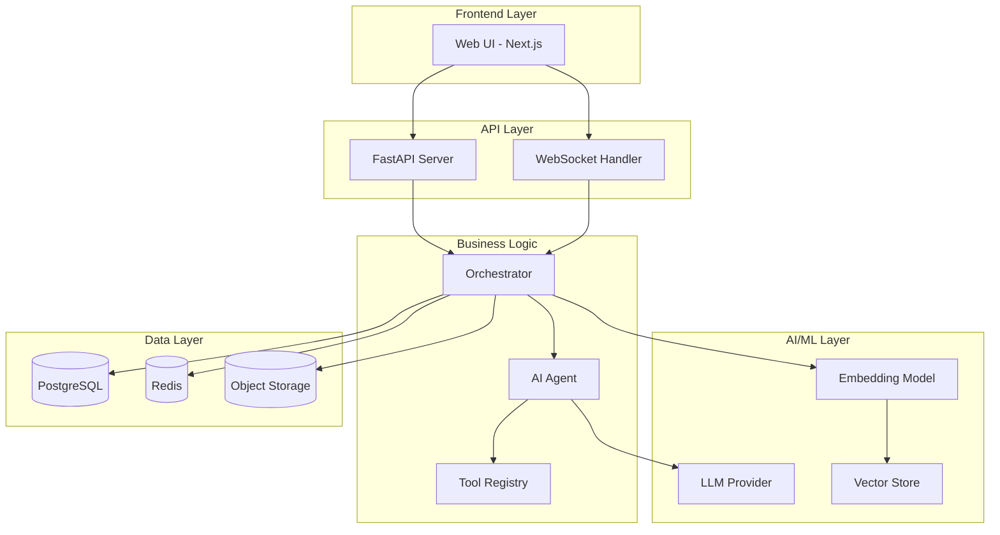
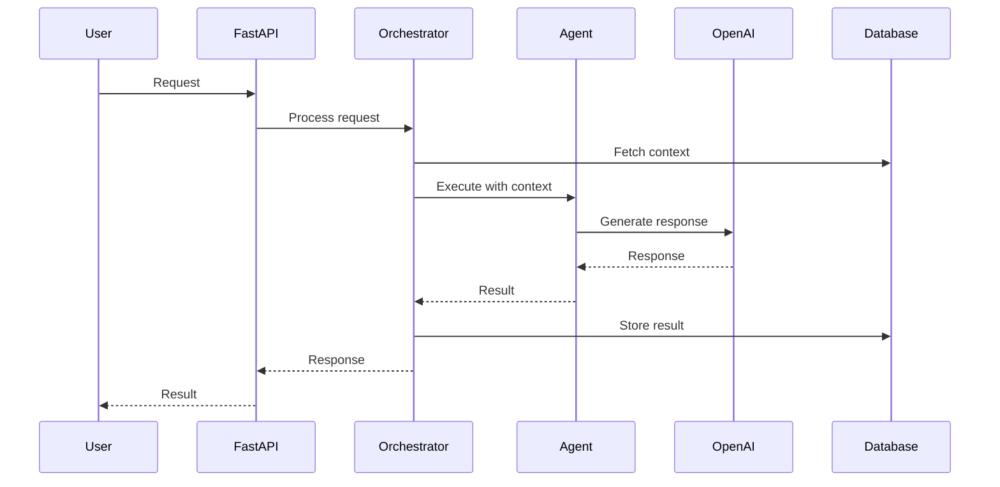
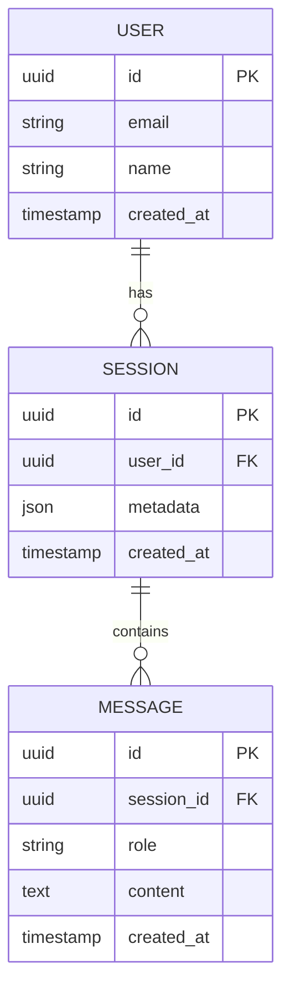
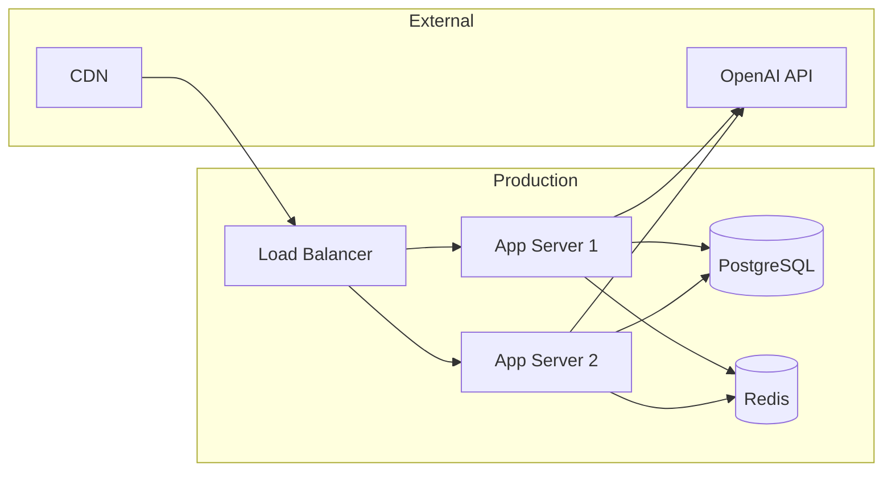

# Architecture: [Project Name]

## System Overview

## Component Architecture

### 1. Frontend Layer

| Component | Technology | Responsibility |
|-----------|-----------|----------------|
| Web UI | Next.js 14 + Tailwind | User interface |
| State Management | React Context / Zustand | Client state |
| API Client | Fetch / Axios | Server communication |

### 2. API Layer

| Component | Technology | Responsibility |
|-----------|-----------|----------------|
| REST API | FastAPI | Request handling |
| WebSocket | FastAPI WebSockets | Real-time updates |
| Auth | JWT / OAuth2 | Authentication |
| Validation | Pydantic | Input validation |

### 3. Business Logic Layer

| Component | Responsibility |
|-----------|----------------|
| Orchestrator | Coordinates workflow between components |
| Agent | LLM-powered reasoning and decision making |
| Tool Registry | Available tools/functions for agent |
| Pipeline | Step-by-step processing pipeline |

### 4. AI/ML Layer

| Component | Technology | Responsibility |
|-----------|-----------|----------------|
| LLM Provider | OpenAI / Ollama | Text generation |
| Embedding Model | OpenAI Ada / Local | Text embeddings |
| Vector Store | ChromaDB / Pinecone | Similarity search |
| Reranker | Cohere / Cross-encoder | Result reranking |

### 5. Data Layer

| Component | Technology | Responsibility |
|-----------|-----------|----------------|
| Primary DB | PostgreSQL | Structured data |
| Cache | Redis | Session state, rate limiting |
| Object Storage | S3 / Local | File storage |
| Search | Elasticsearch | Full-text search |

## Data Flow

## Database Schema

## Deployment Architecture

## Security Architecture

| Layer | Measure | Implementation |
|-------|---------|----------------|
| Transport | TLS 1.3 | Nginx / Cloud LB |
| Authentication | JWT tokens | FastAPI middleware |
| Authorization | RBAC | Permission decorators |
| Input | Validation + Sanitization | Pydantic models |
| AI Safety | Guardrails | Output filtering |
| Secrets | Environment variables | .env + vault |
| Rate Limiting | Per-user limits | Redis-based |

## Performance Considerations

| Concern | Strategy |
|---------|----------|
| LLM Latency | Streaming responses, model routing |
| Vector Search | Approximate NN, index optimization |
| Database | Connection pooling, query optimization |
| Caching | Redis for frequent queries |
| Concurrency | Async/await throughout |

## Scaling Strategy

1. **Vertical:** Increase server resources
2. **Horizontal:** Multiple app servers behind load balancer
3. **Queue-based:** Celery workers for heavy AI tasks
4. **Cache:** Redis for repeated queries
5. **CDN:** Static assets and frontend

## Monitoring & Observability

| Metric | Tool | Alert Threshold |
|--------|------|----------------|
| Response Time | Prometheus | > 2s |
| Error Rate | Sentry | > 1% |
| LLM Cost | Custom dashboard | > $X/day |
| Queue Depth | Redis metrics | > 100 |
