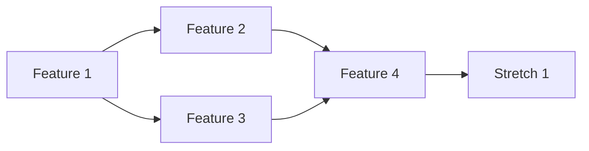

# Features: [Project Name]

## Feature Overview

| # | Feature | Status | Priority | Complexity |
|---|---------|--------|----------|------------|
| 1 | | 🔴 Not Started | P0 - Critical | Low |
| 2 | | 🟡 In Progress | P1 - High | Medium |
| 3 | | 🟢 Complete | P2 - Medium | High |
| 4 | | 🔵 Stretch | P3 - Low | High |

## Core Features (MVP)

### Feature 1: [Name]

**Description:** [What this feature does]

**User Story:** As a [user type], I want to [action] so that [benefit].

**Acceptance Criteria:**
- [ ] Criterion 1
- [ ] Criterion 2
- [ ] Criterion 3

**Technical Notes:**
- Implementation approach
- Dependencies
- Edge cases to handle

---

### Feature 2: [Name]

**Description:** [What this feature does]

**User Story:** As a [user type], I want to [action] so that [benefit].

**Acceptance Criteria:**
- [ ] Criterion 1
- [ ] Criterion 2

---

## Stretch Features

### Stretch 1: [Name]

**Description:** [What this feature does]

**Value:** [Why this matters]

**Complexity:** [What makes this hard]

---

## Feature Dependencies

## Non-Functional Requirements

| Requirement | Target | Measurement |
|-------------|--------|-------------|
| Response Time | < 2s | P95 latency |
| Availability | 99.5% | Uptime monitoring |
| Throughput | 100 req/s | Load testing |
| Security | OWASP Top 10 | Security audit |
| Accessibility | WCAG 2.1 AA | Automated checks |
