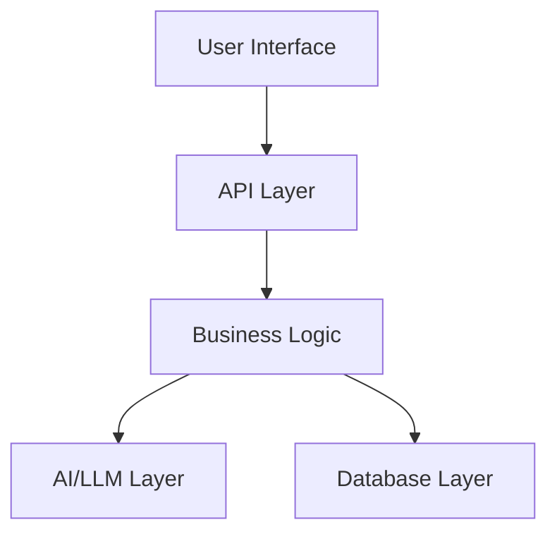

# Project Plan: [Project Name]

## Overview

| Field | Details |
|-------|---------|
| **Project** | [Project Name] |
| **Phase** | [Beginner / Intermediate / Advanced / Enterprise / Research] |
| **Status** | 🔴 Not Started / 🟡 In Progress / 🟢 Completed |
| **Started** | YYYY-MM-DD |
| **Completed** | YYYY-MM-DD |

## Problem Statement

[Describe the problem this project solves in 2-3 sentences]

## Objectives

- [ ] Objective 1
- [ ] Objective 2
- [ ] Objective 3

## Architecture Overview



## Implementation Phases

### Phase 1: Foundation (Week 1)
- [ ] Project setup and dependencies
- [ ] Database schema design
- [ ] Core API structure
- [ ] Basic frontend scaffold

### Phase 2: Core Features (Week 2-3)
- [ ] Feature 1
- [ ] Feature 2
- [ ] Feature 3

### Phase 3: AI Integration (Week 3-4)
- [ ] LLM integration
- [ ] Prompt engineering
- [ ] Response handling

### Phase 4: Polish & Deploy (Week 4-5)
- [ ] UI polish
- [ ] Error handling
- [ ] Testing
- [ ] Docker containerization
- [ ] Deployment

## Tech Stack

| Layer | Technology | Reason |
|-------|-----------|--------|
| Frontend | | |
| Backend | | |
| Database | | |
| AI/LLM | | |
| Deployment | | |

## API Endpoints

| Method | Endpoint | Description |
|--------|----------|-------------|
| GET | /api/v1/... | |
| POST | /api/v1/... | |

## Data Models

```python
# Define your core data models here
```

## Risk Assessment

| Risk | Impact | Mitigation |
|------|--------|-----------|
| | | |

## Success Criteria

- [ ] Core features functional
- [ ] API documented
- [ ] Tests passing (>80% coverage)
- [ ] Dockerized and deployable
- [ ] README complete with screenshots
