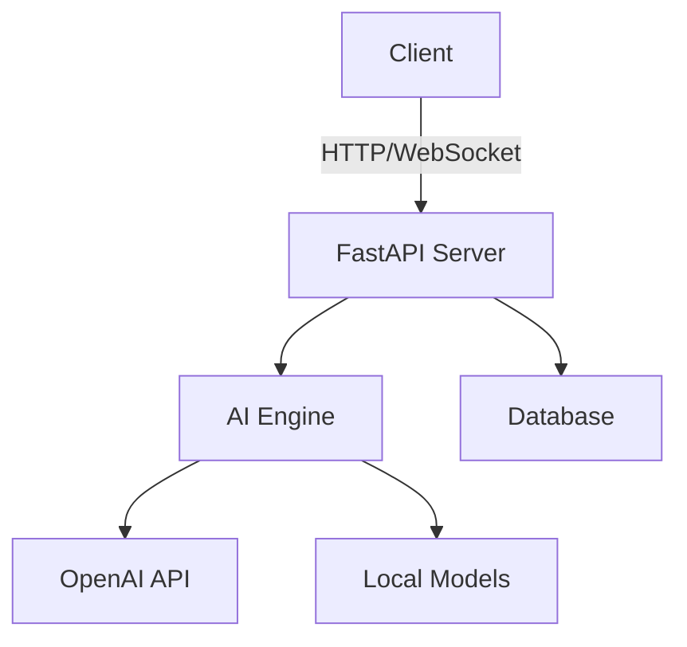

# [Project Name]

> [One-line description of what this project does]


## Table of Contents

- [Features](#features)
- [Architecture](#architecture)
- [Tech Stack](#tech-stack)
- [Quick Start](#quick-start)
- [API Reference](#api-reference)
- [Configuration](#configuration)
- [Testing](#testing)
- [Deployment](#deployment)
- [Contributing](#contributing)

## Features

### Core Features
- ✅ Feature 1
- ✅ Feature 2
- ✅ Feature 3

### Stretch Features
- 🔲 Stretch feature 1
- 🔲 Stretch feature 2

## Architecture



### System Design Decisions

| Decision | Choice | Rationale |
|----------|--------|-----------|
| | | |

## Tech Stack

| Component | Technology | Version |
|-----------|-----------|---------|
| Backend | FastAPI | 0.100+ |
| AI/LLM | OpenAI GPT-4o | Latest |
| Database | PostgreSQL | 15+ |
| Cache | Redis | 7+ |
| Frontend | Next.js | 14+ |
| Containerization | Docker | 24+ |

## Quick Start

### Prerequisites

- Python 3.11+
- Node.js 18+ (for frontend)
- Docker (optional)
- OpenAI API key

### Installation

```bash
# Clone the repository
git clone https://github.com/muzammil5539/RAG-Projects.git
cd RAG-Projects/projects/[phase]/[project-name]

# Create virtual environment
python -m venv .venv
source .venv/bin/activate  # Linux/Mac
# .venv\Scripts\activate   # Windows

# Install dependencies
pip install -r requirements.txt

# Configure environment
cp .env.example .env
# Edit .env with your API keys

# Run the application
python main.py
```

### Docker

```bash
docker compose up --build
```

## API Reference

### Base URL
```
http://localhost:8000
```

### Endpoints

#### `POST /api/v1/[endpoint]`

**Request:**
```json
{
  "field": "value"
}
```

**Response:**
```json
{
  "result": "value",
  "metadata": {}
}
```

Full API documentation available at `http://localhost:8000/docs` (Swagger UI)

## Configuration

| Variable | Description | Default | Required |
|----------|-------------|---------|----------|
| `OPENAI_API_KEY` | OpenAI API key | — | Yes |
| `DATABASE_URL` | Database connection string | sqlite:///./app.db | No |
| `REDIS_URL` | Redis connection URL | redis://localhost:6379 | No |

## Testing

```bash
# Run all tests
pytest

# Run with coverage
pytest --cov=. --cov-report=html

# Run specific test file
pytest tests/test_[module].py -v
```

## Deployment

### Railway / Render

1. Connect GitHub repository
2. Set environment variables
3. Deploy

### Docker Production

```bash
docker compose -f docker-compose.prod.yml up -d
```

## Project Structure

```
[project-name]/
├── main.py                 ← Application entry point
├── config.py               ← Configuration management
├── requirements.txt        ← Python dependencies
├── Dockerfile              ← Container definition
├── docker-compose.yml      ← Multi-service orchestration
├── .env.example            ← Environment template
├── api/                    ← API routes and handlers
├── core/                   ← Business logic
├── models/                 ← Data models
├── services/               ← External service integrations
├── tests/                  ← Test suite
├── static/                 ← Frontend assets
└── screenshots/            ← Project screenshots
```

## Learning Outcomes

After building this project, you will understand:
- [ ] Learning outcome 1
- [ ] Learning outcome 2
- [ ] Learning outcome 3

## License

MIT

---

**Part of the [AI Engineering Universe](../../README.md)** — A comprehensive collection of AI/ML projects from beginner to research-level.
